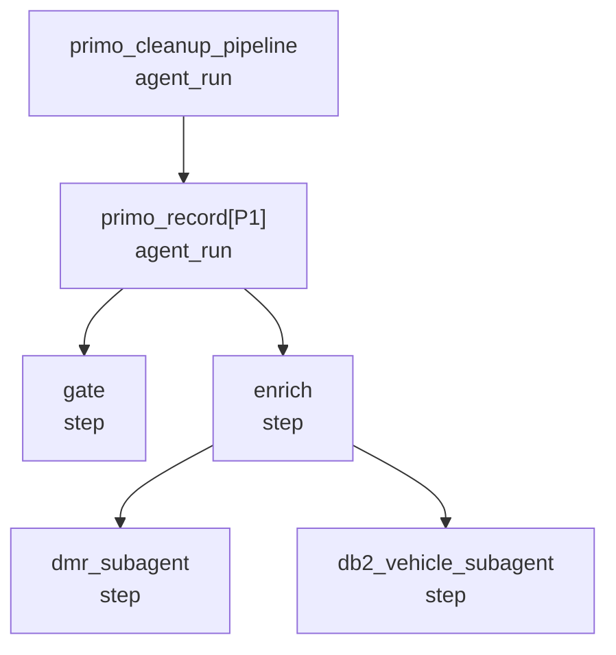
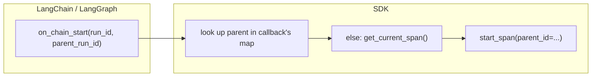
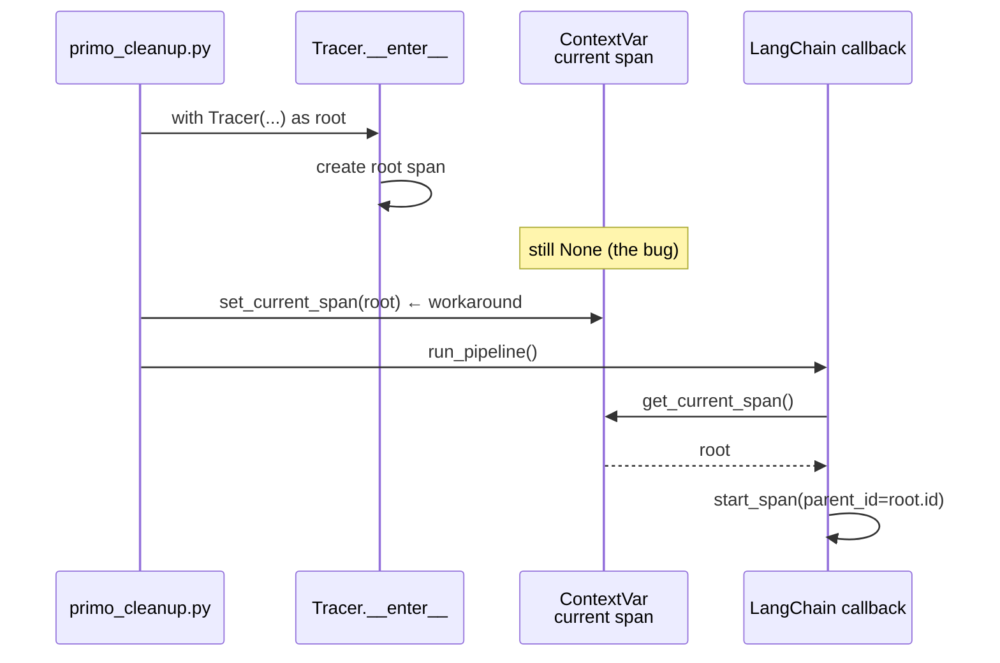
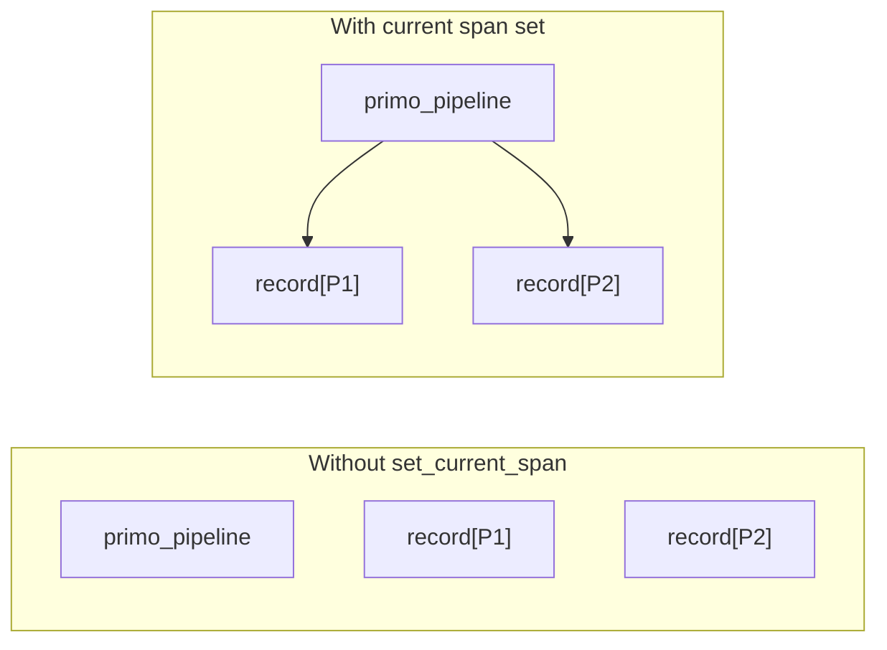
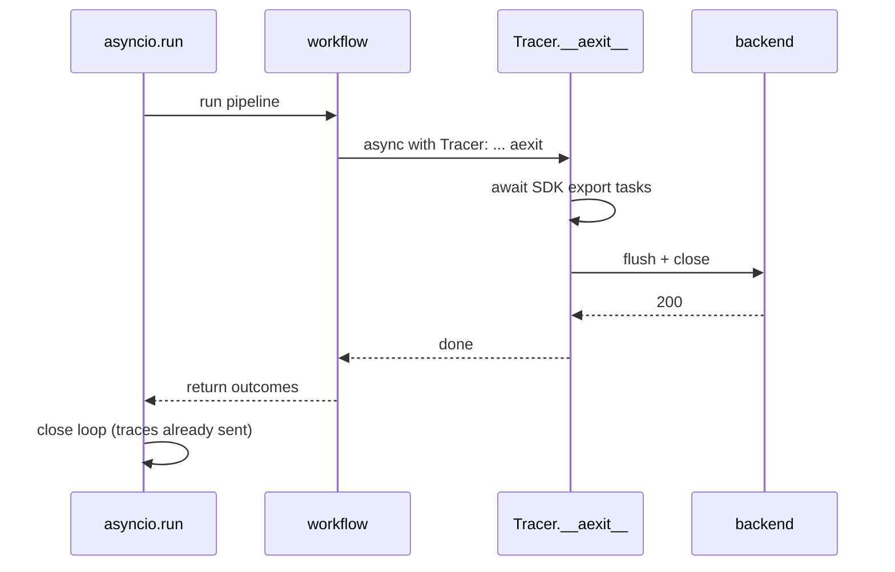
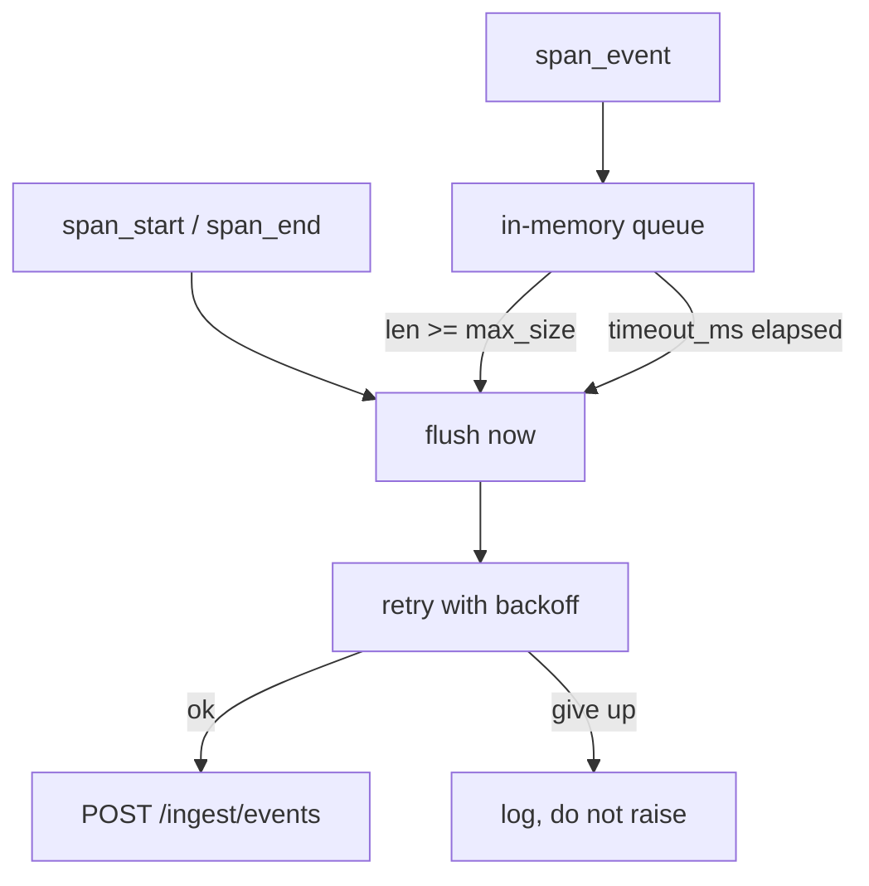
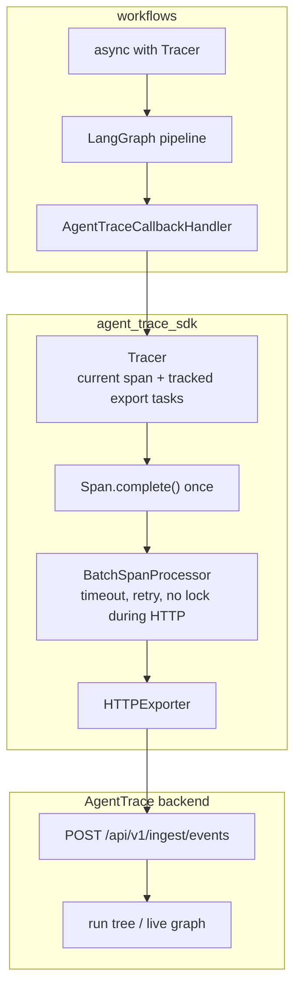

# Why the SDK looked broken (and what we fixed)

## Nutshell

The SDK's job is: **open a trace, nest child spans under it, send those events to the backend before the process exits.**

It advertised that `with Tracer(...)` did all three. It only did the first. The workflow had to finish the job by hand:

1. Push the root span as "current" (`set_current_span`) so children nested under it instead of becoming orphan roots.
2. `asyncio.gather` every leftover task on the event loop so HTTP export actually ran before `asyncio.run` killed the process.
3. Swallow export errors so a down backend didn't fail the pipeline.

Those workarounds were compensating for a **sync, fire-and-forget tracer**. The event model was fine. The enter/exit lifecycle was not.

After the fix, the workflow is just:

```python
async with Tracer(name="primo_cleanup_pipeline", endpoint=ingest_endpoint()):
    return await run_pipeline(csv_path)
```

---

## What a trace is

One **run** is a tree of **spans**. Each span is a unit of work (`agent_run`, `step`, `tool_call`, `llm_call`).



The SDK emits three event types to `POST /api/v1/ingest/events`:

| Event | When | Why it matters |
|---|---|---|
| `span_start` | work begins | UI can spawn a node (`ended_at` is null) |
| `span_event` | input / output / error | details on that node |
| `span_end` | work finishes | UI marks the node completed |

Parenting is just `parent_id` on `span_start`. If that field is missing, the span is a **top-level root**, not a child. That is how you get a flat, broken tree in the UI.

---

## The two pieces of "current"

LangGraph does not talk to our SDK. A callback (`AgentTraceCallbackHandler`) translates LangChain run events into `tracer.start_span(...)`.

When a graph node starts, the callback has to answer: **who is my parent span?**



For the **outermost** graph run there is no LangChain parent. The fallback is `get_current_span()` — a `ContextVar` meaning "the span this task is currently inside."

That only works if entering `Tracer` actually **sets** that ContextVar. The docstring said it did. The code did not.

---

## Bug 1 — entering Tracer did not set the current span

### What the docstring promised

```python
with Tracer(name="my_agent") as span:
    # span is supposed to be get_current_span() here
    ...
```

### What actually happened

`Tracer.__enter__` created a root span and returned it. It never called `set_current_span`. Only `with some_span:` did that, inside `Span.__enter__`.

You might think: then do `with Tracer(...) as span:` **and** `with span:`. That ends the span twice — `Span.__exit__` emits `span_end`, then `Tracer.__exit__` emits `span_end` again.

So the workflow did the only safe thing: push the ContextVar by hand, without entering the span a second time.



Without that workaround, every record's graph run became its **own** top-level span. The pipeline root existed, but nothing hung under it.



### The fix

`__enter__` / `__aenter__` now:

1. Create the root span
2. `set_current_span(root)` and keep the reset token
3. On exit, `complete()` the root once, then restore the previous current span

`Span.complete()` is idempotent, so a double-end cannot emit two `span_end` events.

`start_span()` also inherits the current span as `parent_id` when the caller doesn't pass one.

---

## Bug 2 — export was fire-and-forget, so the CLI dropped traces

The SDK is async internally (`httpx.AsyncClient`). The public API was a **sync** context manager.

On a running event loop it did:

```python
loop.create_task(self._processor.add_event(event))  # never awaited
```

That is fine in a long-lived server: the loop keeps spinning and the tasks run.

It is fatal in our CLI:

```python
outcomes = asyncio.run(run_primo_cleanup_pipeline(csv_path))
```

`asyncio.run` creates a loop, runs the coroutine, then **closes the loop**. Tasks that were only scheduled, not awaited, die with it. Traces never leave the process.

```mermaid
sequenceDiagram
    participant CLI as asyncio.run
    participant W as workflow
    participant T as Tracer.__exit__
    participant Loop as event loop
    participant HTTP as backend

    CLI->>W: run pipeline
    W->>T: with Tracer: ... exit
    T->>Loop: create_task(flush)
    Note over Loop,HTTP: flush has not run yet
    W-->>CLI: return outcomes
    CLI->>Loop: close loop
    Note over HTTP: never received the batch
```

The workaround was worse than it looks:

```python
pending = [t for t in asyncio.all_tasks() if t is not asyncio.current_task()]
await asyncio.gather(*pending, return_exceptions=True)
```

That waits for **every** leftover task on the loop, not just SDK export. A hung unrelated task would hang shutdown. A missing export task would still drop traces.

### The fix

- Track **only** SDK export tasks on the tracer.
- Add a real async context manager. `__aexit__` awaits those tasks, then `processor.close()`.
- The CLI uses `async with`, so flush finishes **before** `asyncio.run` closes the loop.



Sync `with Tracer(...)` still works when **no** loop is running (each emit uses `asyncio.run`). Inside an already-running loop it warns: use `async with`.

---

## Bug 3 — the batch processor did not do what it claimed

`BatchSpanProcessor` advertised three behaviors it did not implement:

| Claim | Reality before | Now |
|---|---|---|
| Flush a partial batch after `timeout_ms` | `timeout_ms` was never read | A timer flushes leftover `span_event`s |
| Retry with exponential backoff | One POST, then raise | Configurable retries, then log |
| "Don't hold the lock during the HTTP call" | Held the queue lock the whole time | Take the batch under the lock, export without it |

Raising on export failure also leaked into the workflow: a down backend could fail the **agent run**. The workflow wrapped everything in `try/except` so traces were best-effort.

Export errors are now swallowed **inside the SDK**. A down backend logs and moves on. The pipeline still returns outcomes.

Span start/end also flush immediately (not only at 100 events / 5s). That is what a live run graph needs: the UI can see a node as soon as work starts.



---

## Why the workflow file was a smell

Before, `primo_cleanup.py` was ~50 lines, most of it comments explaining why the SDK could not be used as documented:

```python
with Tracer(...) as root_span:
    set_current_span(root_span)          # bug 1
    try:
        result = await run_pipeline(...)
    finally:
        set_current_span(None)
pending = [t for t in asyncio.all_tasks() if t is not current]
await asyncio.gather(*pending, ...)     # bug 2
except Exception:
    if result is None:
        raise                           # bug 3, plus export errors
```

None of that is pipeline logic. It is the caller doing the tracer's job.

After:

```python
async with Tracer(name="primo_cleanup_pipeline", endpoint=ingest_endpoint()):
    return await run_pipeline(csv_path)
```

---

## How the pieces fit now



Enter `Tracer` → root is current → callback nests children → leave `Tracer` → SDK awaits its own export → process can exit.

---

## Tests that would have caught this

The old SDK tests only checked JSON shape (`type` vs `event_type`, `span_id` inside `data`). The wire format was never the problem, so those tests stayed green.

Lifecycle tests now cover:

- `get_current_span()` is the root inside `with` / `async with`, and is restored after
- each `span_start` has exactly one `span_end`
- after `async with` exits, the exporter already has the batch (no gather-all-tasks)
- `asyncio.run(async with Tracer)` still exports — the CLI pattern
- a raising exporter does not fail the run
- `timeout_ms` flushes a partial batch
- adding an event does not block on an in-flight HTTP call

---

## What we deliberately did not change

- **Event model and HTTP ingest.** Backend, UI, and workflow tests already depended on it.
- **`Tracer._instance` singleton.** Fine for one CLI process. Wrong if two tracers overlap. Not urgent for this PoC.
- **LangChain callback living in `workflows/`.** It is a thin bridge and already nests correctly once current span works. Moving it into the SDK is later.

Switching to LangSmith or Langfuse would give a mature callback and a hosted UI. It would **not** feed AgentTrace. The local debugger is the product; the SDK exists to feed this stack.
