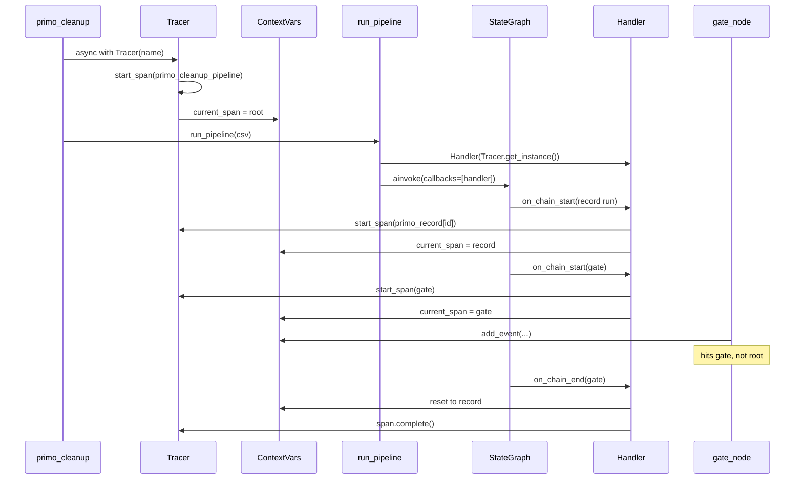
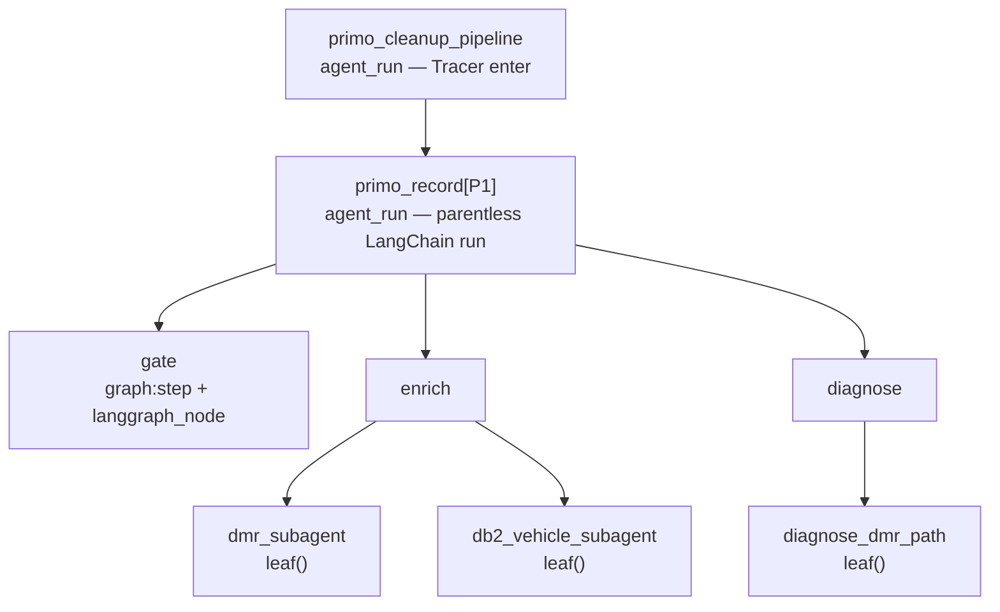

# How tracing works now

`sdk-lifecycle.md` is the old story: Tracer enter/exit was broken, the workflow compensated. That is fixed. This is the current shape after the LangChain handler moved into the SDK.

## Nutshell

Three objects, three jobs:

| Object | Job |
|---|---|
| `Tracer` | One AgentTrace **run**. Owns export. On enter, pushes root span + run_id into ContextVars (and `Tracer._instance`). |
| `AgentTraceCallbackHandler` | LangGraph’s listener. Turns a **subset** of chain runs into child spans on **that** tracer. |
| ContextVars (`current_span`, `current_run_id`) | Ambient “who am I in?” so `add_event()` and parent fallback need no extra arguments. |

LangGraph never imports the SDK. It only calls whatever is in `config["callbacks"]`. ContextVars never subscribe to graph events. Both are required.

```python
async with Tracer(name="primo_cleanup_pipeline", endpoint=ingest_endpoint()):
    return await run_pipeline(csv_path)
```

`run_pipeline` builds one handler from `Tracer.get_instance()` and puts it in each record invoke’s `callbacks`.



## The tree one CSV record produces



Parenting is `parent_id` on `span_start`. The handler decides the parent; the ContextVar is the fallback when LangChain has no parent run (the per-record root hangs under the pipeline root).

## What the handler keeps vs what ContextVars keep

These are not duplicates.

- **`_parents` / `_spans`**: LangChain fires many wrapper runs (`RunnableParallel`, sequences). Those are recorded in `_parents` but **not** turned into spans. When a real child starts, parent is found by walking up until a run that has a span.
- **`_tokens`**: so `on_chain_end` can restore the previous current span. Needs `run_inline = True` so start and end share an asyncio task; otherwise `Token.reset` raises and spans never complete.
- **`self._tracer`**: set once from `Tracer.get_instance()` when the handler is built. The handler does not look up the singleton on every callback.
- **ContextVars**: what node code (`add_event`) and `get_current_run_id()` see.

## Which LangChain runs become spans

A span is created only if one of:

1. Graph node — tag `graph:step:*` and `metadata["langgraph_node"]`
2. `leaf()` — tag `agent_trace:leaf` (type travels as `leaf_span_type`, because node `span_type` would win the merge)
3. Parentless run — the per-record `ainvoke` (`primo_record[...]`)

Everything else is skipped. `attribute_keys` (`record_id`, `policy_id`) are copied only onto that parentless root.

`leaf()` is the escape hatch for parallel branches inside a node. Spanning every named runnable would bring wrapper noise back.

## Call site

```python
# primo_cleanup.py — Tracer enter is enough
async with Tracer(name="primo_cleanup_pipeline", endpoint=ingest_endpoint()):
    return await run_pipeline(csv_path)

# orchestrator.py — one handler per pipeline run, reused for each record
handler = AgentTraceCallbackHandler(
    Tracer.get_instance(),
    attribute_keys=("record_id", "policy_id"),
)
await _GRAPH.ainvoke(..., config={"callbacks": [handler], ...})
```

`_run_record` still takes the handler because that is how it reaches LangGraph’s `config["callbacks"]`. ContextVars cannot replace that list.

`Tracer._instance` is still what decorators (`trace_span`) use. Fine for one CLI process.

## What we are not doing

- Replacing ContextVars with explicit tracer/span arguments through every node.
- Making `start_span` also `set_current_span` (collides with `Span.__enter__` and the decorator path).
- Dropping `_parents` until a full pipeline run has proven parent-via-ContextVar alone is enough.
- Expanding into `on_llm_*` / `on_tool_*` callbacks.
